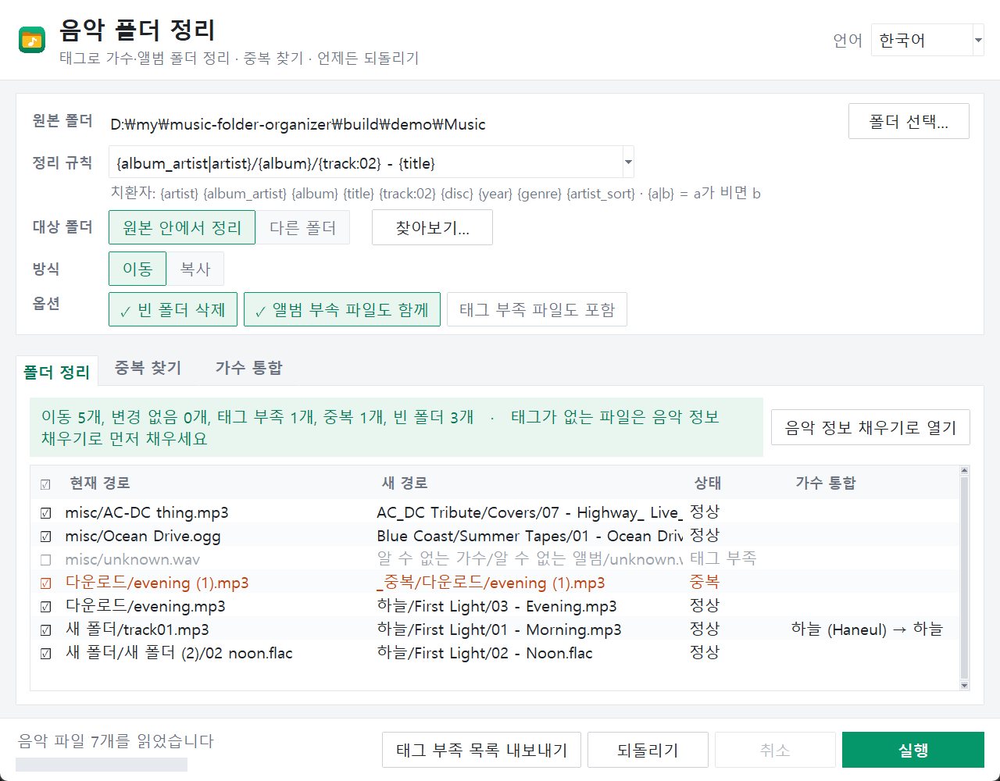

# 音楽フォルダ整理 (Music Folder Organizer)


[한국어](README.md) · [English](README.en.md) · [中文](README.zh-CN.md)

> **インターネット接続なしで動作します。**
> **既定はコピーではなく移動です。元に戻せます。**

`ダウンロード/新しいフォルダー/新しいフォルダー (2)` に散らばった音楽ファイルを、タグ(アーティスト・アルバム・トラック・タイトル)をもとに `アーティスト/アルバム/01 - タイトル.mp3` の構成に移し、同じ曲が複数あれば見つけて整理する Windows ツールです。



## ダウンロード

- **実行ファイル**: [Releases](https://github.com/microhan1/music-folder-organizer/releases) から `music-folder-organizer.exe` を取得してダブルクリック。インストール不要です。(署名のない exe のため SmartScreen の警告が出たら「詳細情報 → 実行」)
- **ソースから実行** (Python 3.12):

```bash
pip install -r requirements.txt
python main.py
```

## 使い方

1. 音楽フォルダをウィンドウにドロップします。
2. プレビュー表で 現在のパス → 新しいパス を確認します。動かしたくないファイルはチェックを外します。
3. **実行** を押します。気に入らなければ **元に戻す** で元の場所に戻ります。

実行するまでファイルは一切動きません。表の上に「移動 n 件、変更なし n 件、タグ不足 n 件、重複 n 件、空フォルダ n 件」が常に表示されます。

| 状態 | 意味 |
| --- | --- |
| 正常 | 新しいパスへ移動 |
| 変更なし | すでに正しい場所 |
| タグ不足 | タイトルかアーティストが空。既定では対象外(オプションで「不明なアーティスト」フォルダへ) |
| 重複 | `_重複` フォルダへ(またはごみ箱) |
| 衝突 | 新しいパスが重なるため ` (2)` を付ける(黄色) |

## 整理ルール

3 つのプリセットから選ぶか、自分で入力します。

- `{album_artist|artist}/{album}/{track:02} - {title}` (既定)
- `{artist}/{title}`
- `{year}/{artist} - {title}`

| 置換子 | 値 |
| --- | --- |
| `{artist}` | アーティスト |
| `{album_artist}` | アルバムアーティスト |
| `{album}` | アルバム |
| `{title}` | タイトル(空なら元のファイル名) |
| `{track}`, `{track:02}` | トラック番号(`:02` = 2 桁)。タグが空ならファイル名の先頭の数字 |
| `{disc}` | ディスク番号 |
| `{year}` | 年(4 桁) |
| `{genre}` | ジャンル |
| `{artist_sort}` | ソート用アーティスト名(日本語・中国語のアーティストをローマ字のフォルダに) |
| `{a\|b}` | a が空なら b |

空の値は「不明なアーティスト」「不明なアルバム」などの代替名で埋めます(`settings.json` の `fallbacks` で変更)。ファイル名に使えない文字(`<>:"/\|?*`)は `_` に置き換え、パスが 240 文字を超えるとタイトルから短くします。

`.lrc`、音楽情報フィラーのバックアップ(`.tagbak.json`)、`cover.jpg`・`folder.jpg` は音楽ファイルと一緒に移動します。空になった元のフォルダは削除します(`Thumbs.db`・`desktop.ini` だけが残ったフォルダも含む)。

**アルバムの付属ファイル**: 一つのフォルダの曲がすべて同じ新しいフォルダへ移るときは、そのアルバムの `.cue`・`.log`・`.txt`・`.nfo`・`.m3u`・`.pdf`・画像と、それらだけが入ったサブフォルダ(`Artwork`・`Scans` など)も一緒に移動します。曲が複数のアルバムに分かれる場合や、一覧にないファイル(個人の文書など)はその場に残します。オプション「アルバムの付属ファイルも一緒に」で切り替えられます(`--no-sidecars`)。

**cue のあるアルバム**: フォルダの `.cue` がそのフォルダの音楽ファイル名を指している場合、曲のファイル名は変えずにフォルダだけを整理ルールどおりに移動します(cue が壊れないように。cue の内容も変更しません)。

## 重複検索

| 段階 | 基準 |
| --- | --- |
| 1. 完全一致 | ファイル内容が同じ(SHA-1) |
| 2. 同じ曲 | アーティスト + タイトルが同じで、長さの差が 2 秒以内 |
| 3. 音 | 音響指紋の比較(Chromaprint、ローカルのみ)。タグが違っても同じ録音を見つける |

**同じアルバム内の余分だけを整理します。** 元のアルバムとベスト盤のように複数のアルバムに入った同じ曲は一つのグループとして表示しますが、**アルバムごとに 1 つ残します**(グループ名に「アルバム n 枚」と表示)。同じアルバム内ではロスレス(flac) → ビットレートが高い方 → すでに正しい場所にある方を残します。**残す** で変更、**適用** を外すとグループごと対象外にできます。コマンドラインで別のアルバム間でも 1 つだけ残すには `--dedupe-across-albums`。

残さないファイルは削除せず `_重複` フォルダへ移します。ごみ箱へ送ることもできますが、ごみ箱へ送ったファイルはこのツールの「元に戻す」では戻りません。

## アーティスト統合

`岡田 有希子`、`岡田有希子`、`Yukiko Okada` のように表記が混ざるとフォルダが分かれます。次の順でまとめます。

1. 同じ MusicBrainz / iTunes アーティスト ID
2. スペース・全角・大文字小文字の違い、末尾の別の文字体系の括弧(`Minako Yoshida (吉田美奈子)`)
3. `artists.json` — `{"岡田有希子": ["岡田 有希子", "Yukiko Okada", "오카다 유키코"]}`(キーがフォルダ名)
4. 同じフォルダ・同じアルバムでアーティスト表記が違うときは「同じアーティストですか?」と尋ねます(青色)。確認するまで適用されず、確認すると `artists.json` に保存されます。

**アーティスト統合** タブで代表名を変えたり、グループを解除したりできます。

## コマンドライン

```bash
python main.py ./music --dry-run                       # 一覧だけ表示し、何も移動しない
python main.py ./music --dest ./sorted --copy          # 別のフォルダへコピー
python main.py ./music --dedupe --fingerprint          # 重複(音による検出も)を _重複 フォルダへ
python main.py ./music --pattern "{artist}/{title}"
python main.py ./music --undo                          # 直近の整理を元に戻す
```

`python main.py --help` で OS の言語のオプション一覧が出ます。テスト: `pip install -r requirements-dev.txt` の後、`python samples/make_samples.py` と `python -m pytest tests`。

## 音楽情報フィラーと一緒に

タグが空なら、先に [音楽情報フィラー (music-tag-filler)](https://github.com/microhan1/music-tag-filler) で埋めてください。

- タグ不足のファイルがあると、概要行の右に **音楽情報フィラーで開く** が表示されます。押すとそのファイル(mp3・flac・m4a・ogg)を音楽情報フィラーで直接開き、そのウィンドウを閉じるとここでタグを読み直します。音楽情報フィラーの場所は最初に一度だけ尋ねて記憶します(このプログラムの隣や同じ階層の `music-tag-filler\dist` にあれば自動で見つけます)。
- 音楽情報フィラーが書き込む MusicBrainz・iTunes アーティスト ID で、表記の違う同じアーティストを一つのフォルダにまとめます。
- そのツールのバックアップ(`.tagbak.json`)も一緒に移動するので、フォルダ整理の後もあちらで元に戻せます。
- **タグ不足リストを書き出す** で `untagged.txt` を作ることもできます。

## しないこと

- タグを変更しません。読むだけです(タグの編集は音楽情報フィラーの役目)。
- インターネットに接続しません。音響指紋もローカルで比較します。
- ファイルをすぐに削除しません。`_重複` フォルダへ移すか、ごみ箱へ送ります。
- 形式の変換・再生・プレイリスト作成はしません。
- 歌詞・カバー画像・アルバムの付属ファイルは音楽ファイルと一緒に移動するだけで、内容は変更しません。

## ライセンス

- MIT License ([LICENSE](LICENSE))
- 同梱の `third_party/fpcalc.exe`(Chromaprint、FFmpeg の一部を含む)は LGPL 2.1 です ([third_party/LICENSE-chromaprint](third_party/LICENSE-chromaprint))。
