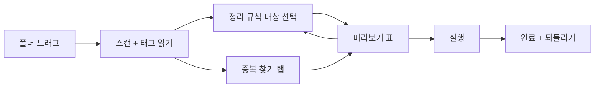

# PRD — 음악 폴더 정리 (music-folder-organizer)

작성일: 2026-10-01

## 개요

뒤섞인 음악 파일을 태그(가수·앨범·트랙·제목) 기준으로 `가수/앨범/트랙 - 제목.mp3` 폴더 구조로 옮기고, 같은 곡이 여러 개 있으면 찾아서 정리해주는 Windows 단일 실행 파일 도구다. 음악 정보 채우기(music-tag-filler)의 짝으로, 태그를 채운 다음 폴더를 정리하는 순서로 쓴다. 인터넷 연결이 필요 없다.

**명칭**

| 구분 | 값 |
| --- | --- |
| 한글 명칭 | 음악 폴더 정리 |
| 영문 명칭 | Music Folder Organizer |
| 저장소명 / 실행 파일명 | `music-folder-organizer` / `music-folder-organizer.exe` |
| 앱 제목 (ko / en / zh-CN / ja) | 음악 폴더 정리 / Music Folder Organizer / 音乐文件夹整理 / 音楽フォルダ整理 |

음악 정보 채우기와 같은 계열이므로 README에서 서로 링크한다. 책갈피 툴 시리즈 이름은 붙이지 않는다.

**대상 사용자**

- 1순위: 본인. 내려받은 음악이 `다운로드/새 폴더/새 폴더(2)`에 쌓여 있는 경우
- 음악 정보 채우기로 태그를 채운 뒤 폴더까지 정리하고 싶은 사람
- 같은 곡을 여러 번 받아 용량만 차지하는 사람
- NAS·USB·차량 재생기에 가수별 폴더로 넣고 싶은 사람

**다국어 지원**

- 언어 파일: `lang/ko.json`, `lang/en.json`, `lang/zh-CN.json`, `lang/ja.json`. 키는 영문 snake_case
- 최초 실행 시 OS 언어 자동 선택. 4개 언어 밖이면 영어
- 화면 우상단 드롭다운으로 즉시 전환, 선택값은 실행 파일 옆 `settings.json`에 저장
- 버튼·안내·오류·완료 메시지·표 헤더 전부 언어 파일에서 읽는다. 코드에 문자열 하드코딩 금지
- 폴더·파일 이름에 들어가는 태그 값은 원문 그대로. 태그가 비었을 때 쓰는 대체 문구("알 수 없는 가수" 등)만 언어 파일에서 가져오며, 사용자가 settings에서 바꿀 수 있다

**기술 스택**

| 항목 | 선택 | 이유 |
| --- | --- | --- |
| 언어 | Python 3.12 | music-tag-filler와 코드 공유 |
| 태그 읽기 | mutagen | mp3·flac·m4a·ogg·wav(태그 없음) |
| 중복 판별 | 파일 해시(SHA-1) + 태그 일치 + 길이 비교 | 1차 완전 동일, 2차 같은 곡 다른 인코딩 |
| 음향 지문(옵션) | fpcalc.exe(Chromaprint), 로컬 비교만 | 태그가 달라도 같은 녹음인지 판별. AcoustID 서버는 쓰지 않음 |
| GUI | tkinter (ttk.Treeview) | 미리보기 표에 충분 |
| 배포 | PyInstaller 단일 exe (Windows), fpcalc.exe 동봉 | 더블클릭 실행. `python main.py`로 소스 실행도 유지 |

**배포 규칙**

- exe는 저장소가 아니라 GitHub Releases 첨부. 첫 태그 `v0.1.0`
- fpcalc.exe는 LGPL. `third_party/`에 라이선스 원문 동봉
- 테스트 파일은 CC0 음원만 `samples/`에
- README 맨 위에 "인터넷 연결 없이 동작합니다"와 "기본값은 복사가 아니라 이동입니다. 되돌리기가 있습니다" 두 줄

## 기능 명세

**핵심 기능**

1. 폴더 읽기: 원본 폴더를 드래그하면 하위 폴더까지 훑어 음악 파일 목록과 태그를 읽는다. 진행 표시 + 취소
2. 정리 규칙: 프리셋 세 가지 + 직접 입력
   - `{artist}/{album}/{track:02} - {title}` (기본)
   - `{artist}/{title}`
   - `{year}/{artist} - {title}`
   - 치환자: `{artist}`, `{album_artist}`, `{album}`, `{title}`, `{track}`, `{disc}`, `{year}`, `{genre}`. 비어 있으면 대체 문구(settings에서 변경)
3. 대상 폴더: 원본 안에서 정리(제자리) 또는 다른 폴더로 이동/복사. 기본은 원본 안 이동
4. 이동/복사 선택: 기본 이동. 복사를 고르면 원본은 그대로 두고 대상에 새 구조 생성
5. 미리보기 표: 파일별로 현재 경로 → 새 경로, 상태(정상 / 변경 없음 / 태그 부족 / 중복 / 충돌). 체크박스로 제외. 실행 전엔 아무것도 옮기지 않음
6. 중복 찾기 (별도 탭)
   - 1단계 완전 동일: 파일 해시가 같음 → 자동으로 하나만 남김 표시
   - 2단계 같은 곡: 가수+제목 정규화 일치이고 길이 차이 2초 이내 → 그룹으로 묶어 표시, 비트레이트 높은 쪽을 "남김" 추천, 사용자가 바꿀 수 있음
   - 3단계(옵션, 기본 끔): 음향 지문 로컬 비교. 태그가 달라도 같은 녹음이면 그룹에 추가. 시간이 걸리므로 켤 때 예상 시간 표시
   - 중복 처리 방식: 삭제하지 않고 `_중복/` 폴더로 이동. 휴지통 보내기는 옵션
7. 파일명 정리: 운영체제 금지문자 제거, 앞뒤 공백 제거, 연속 공백 하나로, 경로 길이 240자 제한(초과 시 제목 줄임)
8. 빈 폴더 정리: 이동 후 비게 된 원본 폴더 삭제. 옵션, 기본 켬, 미리보기에 삭제될 폴더 수 표시
9. 되돌리기: 실행 시 대상 폴더에 `organize_log.json`(원래 경로 → 새 경로, 삭제한 빈 폴더) 저장. 되돌리기 버튼으로 전부 복구
10. 음악 정보 채우기 연계: 태그 부족 파일이 있으면 "먼저 태그를 채우세요" 안내와 함께 해당 파일 목록을 `untagged.txt`로 내보내기

**11. 아티스트 통합**

같은 가수가 `岡田 有希子`, `岡田有希子`, `Yukiko Okada`처럼 여러 표기로 섞여 있으면 폴더가 셋으로 갈라진다. 아래 순서로 한 사람으로 묶고, 대표 이름 하나로 폴더를 만든다.

| 단계 | 방법 | 자동 여부 |
| --- | --- | --- |
| 1 | 태그에 `MUSICBRAINZ_ARTISTID`(또는 `iTunes Artist Id`)가 있으면 ID가 같은 파일은 같은 가수 | 자동 |
| 2 | 표기 정규화: 공백 제거, 전각→반각, 대소문자 통일, 괄호 안 부가 표기 제거 후 비교 (`岡田 有希子` = `岡田有希子`) | 자동 |
| 3 | 별칭 파일 `artists.json`: `{"岡田有希子": ["岡田 有希子", "Yukiko Okada", "오카다 유키코"]}` 형식. 키가 대표 이름, 값이 변형들 | 자동 (사용자가 파일을 채움) |
| 4 | 추측: 같은 앨범명(정규화 후)을 가진 파일들의 가수 표기가 서로 다르면 "같은 가수인가요?" 그룹으로 제안. 확인하면 `artists.json`에 자동 추가 | 사용자 확인 필수 |

- 대표 이름 규칙: `artists.json`의 키 → 없으면 settings의 `artist_name_preference`(`original` 기본 / `latin`)에 맞는 표기 → 그것도 없으면 파일 수가 가장 많은 표기
- 정렬용 이름(`ARTISTSORT`)이 있으면 치환자 `{artist_sort}`로 쓸 수 있다. 일본어·중국어 가수를 로마자 폴더로 정렬하고 싶을 때 사용
- 통합 결과는 미리보기 표에 "岡田 有希子 → 岡田有希子"처럼 표시하고, 별칭 탭에서 대표 이름을 바꾸거나 그룹을 풀 수 있다
- 4단계 추측으로 묶은 것은 미리보기에서 파란색으로 구분하고, 실행 전 확인 없이는 적용하지 않는다
- `artists.json`은 실행 파일 옆에 두고, 음악 정보 채우기와 같은 파일을 공유할 수 있게 경로를 settings에서 지정

**하지 않는 것**

- 태그를 수정하지 않는다. 읽기만 한다 (태그 수정은 음악 정보 채우기의 일)
- 인터넷에 연결하지 않는다. 음향 지문도 로컬 비교만
- 파일을 바로 삭제하지 않는다. `_중복/` 이동 또는 휴지통만
- 포맷 변환·재생·재생목록 생성은 하지 않는다
- 가사·표지 파일(`.lrc`, `cover.jpg`)은 같은 폴더의 음악 파일을 따라 함께 이동하는 것 외에는 다루지 않는다

**입출력**

- 입력: 폴더 (드래그). 대상 확장자 `.mp3`, `.flac`, `.m4a`, `.ogg`, `.wav`, `.wma`. 함께 이동: 같은 폴더의 `.lrc`, `cover.jpg`, `folder.jpg`
- 출력: 정리된 폴더 구조. `organize_log.json`, (중복 시) `_중복/`, (태그 부족 시) `untagged.txt`
- 원본 파일 내용은 바이트 단위로 변하지 않는다

**UI 흐름**



미리보기 표의 상단에 "이동 {move}개, 변경 없음 {same}개, 태그 부족 {untagged}개, 중복 {dupes}개, 삭제될 빈 폴더 {folders}개"를 항상 표시한다.

**CLI**

`python main.py ./music --pattern "{artist}/{album}/{track:02} - {title}" [--dest ./sorted] [--copy] [--dedupe] [--fingerprint] [--dry-run]` · 되돌리기: `python main.py ./music --undo`

**언어 파일 키 (필수 목록)**

| 키 | ko | en |
| --- | --- | --- |
| `app_title` | 음악 폴더 정리 | Music Folder Organizer |
| `drop_hint` | 음악 폴더를 여기에 끌어다 놓으세요 | Drop a music folder here |
| `tab_organize` | 폴더 정리 | Organize |
| `tab_dupes` | 중복 찾기 | Duplicates |
| `pattern_label` | 정리 규칙 | Folder pattern |
| `dest_label` | 대상 폴더 | Destination |
| `opt_move` | 이동 | Move |
| `opt_copy` | 복사 | Copy |
| `opt_remove_empty` | 빈 폴더 삭제 | Remove empty folders |
| `opt_fingerprint` | 소리로 중복 찾기 (느림) | Find duplicates by sound (slow) |
| `col_current` | 현재 경로 | Current path |
| `col_new` | 새 경로 | New path |
| `col_status` | 상태 | Status |
| `col_keep` | 남김 | Keep |
| `status_same` | 변경 없음 | No change |
| `status_untagged` | 태그 부족 | Missing tags |
| `status_dup` | 중복 | Duplicate |
| `status_conflict` | 충돌 | Conflict |
| `summary` | 이동 {move}개, 변경 없음 {same}개, 태그 부족 {untagged}개, 중복 {dupes}개, 빈 폴더 {folders}개 | Move {move}, unchanged {same}, missing tags {untagged}, duplicates {dupes}, empty folders {folders} |
| `fallback_artist` | 알 수 없는 가수 | Unknown Artist |
| `fallback_album` | 알 수 없는 앨범 | Unknown Album |
| `btn_run` | 실행 | Run |
| `btn_undo` | 되돌리기 | Undo |
| `btn_export_untagged` | 태그 부족 목록 내보내기 | Export missing-tag list |
| `msg_done` | 완료: {count}개 파일 정리 | Done: {count} files organized |
| `msg_untagged_hint` | 태그가 없는 파일은 음악 정보 채우기로 먼저 채우세요 | Fill missing tags with Music Tag Filler first |
| `msg_no_log` | 되돌릴 기록이 없습니다 | Nothing to undo |

zh-CN, ja 값은 같은 키로 번역해 채운다. 치환자는 네 언어 모두 유지.

## 예외 처리·완료 기준·GitHub 설정

**예외 처리**

| 상황 | 처리 |
| --- | --- |
| 태그 전부 없음(wav 등) | 상태 "태그 부족", 기본 제외. 대체 문구로 넣는 옵션 제공 |
| 가수만 있고 앨범 없음 | 앨범 자리에 대체 문구("알 수 없는 앨범") |
| 새 경로가 서로 같음(충돌) | 두 번째부터 ` (2)` 붙임, 상태 "충돌" 노란색 |
| 새 경로 = 현재 경로 | 건너뜀, "변경 없음" |
| 다른 드라이브로 이동 | 복사 후 삭제 방식, 진행률 표시. 중간 실패 시 복사된 파일만 로그에 기록 |
| 파일 사용 중(재생 중) | 해당 파일 실패로 표시, 나머지 진행 |
| 경로 240자 초과 | 제목을 줄여 맞춤, 상태에 표시 |
| 중복 그룹에서 전부 "남김" 체크 해제 | 경고: 적어도 하나는 남겨야 함, 실행 막음 |
| 빈 폴더 삭제 대상에 숨김 파일(`Thumbs.db`, `.DS_Store`)만 있음 | 빈 폴더로 간주해 삭제 |
| 로그 없이 되돌리기 | "되돌릴 기록이 없습니다" |
| 되돌리기 시 원래 자리에 다른 파일 있음 | 건너뛰고 목록으로 알림 |

**완료 기준**

- [ ] 파일 1,000개 폴더를 스캔해 미리보기까지 10초 이내
- [ ] 실행 후 되돌리기로 1,000개 전부 원래 경로·원래 폴더 구조로 복구
- [ ] 같은 곡 세 번 받은 파일(mp3 128k, mp3 320k, flac)이 한 그룹으로 묶이고 flac이 "남김" 추천됨
- [ ] 한글·일본어·중국어 가수명이 폴더명에서 깨지지 않음
- [ ] 원본 파일 해시가 처리 전후 동일 (내용 무변경)
- [ ] 네트워크를 끊은 상태에서 모든 기능이 동작
- [ ] `--dry-run`이 실제 이동 없이 표만 출력
- [ ] `岡田 有希子`·`岡田有希子`·`Yukiko Okada` 세 표기의 파일이 별칭 파일 한 줄로 한 폴더에 모임
- [ ] 4개 언어 전환 정상

**GitHub 설정**

| 항목 | 값 |
| --- | --- |
| Repository name | `music-folder-organizer` |
| Description | `Organize music files into Artist/Album/Track folders from tags, find duplicates, undo anytime. Offline. 음악 폴더 정리 — 태그 기준 폴더 정리와 중복 찾기` |
| Visibility | Public |
| Add a README file | 켬 (생성 후 4개 언어 README로 교체) |
| .gitignore template | Python |
| License | MIT License (fpcalc는 LGPL, `third_party/LICENSE-chromaprint` 별도) |
| Topics (About에서 추가) | `music`, `organizer`, `mp3`, `flac`, `duplicates`, `id3`, `offline`, `korean` |

**README 구성 (ko / en / zh-CN / ja 동일 구조)**

- 파일: `README.md`(한국어) 상단에 `English · 中文 · 日本語` 링크, 각각 `README.en.md`, `README.zh-CN.md`, `README.ja.md`
- 맨 위에 "인터넷 없이 동작" / "기본은 이동, 되돌리기 있음" 두 줄
- 한 줄 설명 + 정리 전후 폴더 트리 스크린샷 1장
- 다운로드: Releases 링크. 소스 실행: `pip install -r requirements.txt` → `python main.py`
- 사용법 3줄: 폴더 드래그 → 미리보기 확인 → 실행
- 정리 규칙 치환자 표
- 중복 찾기 3단계 설명 (완전 동일 / 같은 곡 / 소리)
- 음악 정보 채우기 링크: "태그가 비어 있으면 이걸 먼저"
- 하지 않는 것 (위 항목 그대로)
- 라이선스 두 줄 (MIT + fpcalc LGPL)

**저장소 구조**

```
music-folder-organizer/
  main.py
  scan.py           # 폴더 훑기, 태그 읽기 (music-tag-filler의 tags.py 재사용)
  pattern.py        # 치환자 → 경로, 파일명 정리, 충돌 처리
  dedupe.py         # 해시 / 태그+길이 / 지문 3단계
  mover.py          # 이동·복사, 빈 폴더 정리, 로그
  undo.py
  gui.py            # 정리 탭 + 중복 탭
  i18n.py
  lang/ko.json en.json zh-CN.json ja.json
  third_party/fpcalc.exe + LICENSE-chromaprint
  samples/
  tests/
  requirements.txt
  build.bat
  README.md README.en.md README.zh-CN.md README.ja.md
  LICENSE
```

## 부록 — 구현 결정 사항 (기본값, 2026-10-01)

검토에서 비어 있던 부분을 아래처럼 정해 구현했다. 바꾸려면 이 표와 코드를 함께 고친다.

**태그 읽기**

- music-tag-filler의 `tags.py`를 그대로 import하지 않고, 같은 방식으로 읽는 읽기 전용 `scan.py`를 둔다. tag-filler의 쓰기·백업 형식에 영향을 주지 않기 위해서다.
- 읽는 필드: title, artist, album, album_artist, year, track, disc, genre, artist_sort, mb_artist_id(MusicBrainz / iTunes Artist Id), compilation
- 형식: mp3·flac·m4a·ogg + wav(ID3) + wma(ASF)
- "태그 부족" = 제목이 비었거나, 가수와 앨범 가수가 둘 다 비었음. 기본으로 체크 해제. "태그 부족 파일도 정리" 옵션을 켜면 대체 문구로 넣는다(제목 대체는 원래 파일명).

**정리 규칙**

- 기본 프리셋: `{album_artist|artist}/{album}/{track:02} - {title}` — `|`는 "앞이 비면 뒤". 피처링 곡·컴필레이션 때문에 앨범이 쪼개지지 않게 한다.
- 치환자가 비고 대체 문구도 없으면(`track`, `disc`) 그 자리와 붙은 구분자(` - ` 등)를 지운다.
- 대체 문구: artist / album / year / genre는 언어 파일 값, settings의 `fallbacks`로 덮어쓸 수 있다. title은 원래 파일명.
- 파일명 정리: NFC 정규화, 금지문자 `<>:"/\|?*`는 `_`로 바꿈(music-tag-filler와 동일, `AC/DC` → `AC_DC`), 제어문자 제거, 연속 공백 하나로, 앞뒤 공백·끝 마침표 제거, 예약어(`CON`, `NUL`, `COM1` …)는 뒤에 `_`.
- 경로 길이: 절대 경로 240자 초과 시 파일명 → 가장 긴 폴더 이름 순으로 줄인다(각 최소 20자). 상태 옆에 "줄임" 표시.
- 확장자는 원래 대소문자 유지.

**충돌**

- 대소문자·NFC를 무시하고 비교한다. 정렬된 원래 경로 순서로 첫 파일이 원래 이름, 다음부터 ` (2)`, ` (3)`.
- 디스크에 이미 있는 파일과 같은 이름이면(이번에 옮겨 가는 파일이라도) 충돌로 보고 번호를 붙인다. 순서 문제로 덮어쓰는 일을 원천적으로 막는다.
- 폴더 대소문자만 다르면 "변경 없음". 파일명 대소문자만 다르면 임시 이름을 거쳐 바꾼다.

**함께 옮기는 파일**

- `<곡 이름>.lrc` → 새 곡 이름에 맞춰 이름까지 바꿔 이동
- `<곡 파일명>.tagbak.json`(음악 정보 채우기 백업) → 새 파일명 + `.tagbak.json`. 이걸 빠뜨리면 그쪽 되돌리기가 깨진다.
- `cover/folder/front.(jpg|jpeg|png)`: 원래 폴더의 곡이 전부 떠나면 가장 많은 곡이 간 폴더로 이동, 나머지 대상 폴더엔 복사. 곡이 하나라도 남으면 모두 복사. 복사 모드에선 항상 복사. 대상에 같은 이름이 있으면 건너뜀.

**중복**

- 1단계(완전 동일): 크기가 같은 파일끼리만 SHA-1. 남김 = 이미 제자리에 있는 파일 → 경로가 짧은 파일 → 이름순.
- 2단계(같은 곡): 통합된 가수 + 정규화 제목이 같고 길이 차 2초 이내. 남김 = 무손실(flac·wav) → 비트레이트 → 샘플레이트 → 1단계 규칙.
- 3단계(소리): `fpcalc -raw`로 지문을 만들고, 길이 차 2초 이내 쌍만 ±8 오프셋에서 비트 오차율 0.15 미만이면 같은 녹음. 예상 시간 = 파일 수 × 0.4초 ÷ 동시 실행 수.
- `_중복` 폴더 이름은 언어 파일의 `dupes_folder`(ko `_중복`, en `_Duplicates`, zh `_重复`, ja `_重複`), settings의 `dupes_folder`로 덮어쓸 수 있다. 위치는 대상 폴더 바로 아래, 안에서는 원본 기준 상대 경로를 유지한다. 다시 스캔할 때 네 이름 모두 제외.
- 복사 모드에서는 남기지 않는 쪽을 복사하지 않을 뿐, 원본은 건드리지 않는다.
- 휴지통은 Windows 휴지통(SHFileOperation). 되돌리기 대상이 아님을 미리보기·완료 메시지에 알린다.
- CLI `--dedupe`는 추천대로 적용한다(남기지 않는 쪽을 `_중복`으로).

**가수 통합**

- 2단계 정규화: NFKC(전각→반각) + casefold + 공백 제거. 괄호는 **끝에 붙은 괄호이고 안의 문자 체계가 바깥과 다를 때만** 떼어 내고, 그 괄호 안 이름도 같은 가수로 묶는다(`Yukiko Okada (岡田有希子)`). `(G)I-DLE`, `Artist (Live)`는 그대로.
- 4단계 추측: 같은 원래 폴더 + 같은 앨범명(정규화)인데 가수 그룹이 다를 때만. 컴필레이션 표시, `Various Artists`류 앨범 가수, 이름에 `feat`, `,`, `&`, ` x `, `/` 같은 협업 표기가 있는 가수는 제외. "아님"을 누르면 settings `artist_rejected`에 기억해 다시 제안하지 않는다.
- 그룹 풀기: `artists.json`으로 묶인 그룹은 그 항목을 지우고, 자동으로 묶인 그룹은 settings `artist_no_merge`에 이름을 넣어 자동 통합에서 뺀다.
- 대표 이름 바꾸기 = `artists.json`에 `{새 이름: [변형들]}`을 쓴다.
- 통합은 `{artist}`, `{album_artist}` 둘 다에 적용한다.

**실행·되돌리기**

- `organize_log.json`은 대상 폴더에 두고 실행마다 `runs`에 쌓는다. 되돌리기는 아직 안 되돌린 가장 최근 실행 하나를 되돌리고, 다시 누르면 그 전 실행을 되돌린다. 마지막 로그 경로는 settings `last_log`에도 남긴다.
- 기록 단위: move / copy(크기·수정 시각 기록) / trash / mkdir / rmdir. 50개마다, 그리고 끝날 때 로그를 저장해 중간에 끊겨도 되돌릴 수 있다.
- 복사 모드 되돌리기 = 이 도구가 만든 사본만 지운다(크기·수정 시각이 기록과 같을 때만). 원본은 원래 건드리지 않았다.
- 다른 드라이브로 이동: 복사하면서 SHA-1 → 대상 다시 읽어 SHA-1 비교 → 같으면 원본 삭제. 다르거나 원본 삭제가 실패하면 사본을 지우고 그 파일은 "실패".
- 빈 폴더: 이동 후 `Thumbs.db`, `.DS_Store`, `desktop.ini`, `ehthumbs.db`만 남은 원본 폴더를 지운다. 원본·대상 루트와 이번에 만든 폴더는 지우지 않는다. 되돌리면 다시 만든다.
- CLI `--undo <폴더>`: 그 폴더의 `organize_log.json`, 없으면 settings `last_log`(원본 또는 대상이 그 폴더일 때).
- 복사 모드에서 대상 = 원본은 허용하지 않는다.

**기타**

- `settings.json`은 실행 파일 옆, 쓸 수 없으면 `%APPDATA%\music-folder-organizer\`.
- `untagged.txt`: GUI는 버튼으로 저장 위치를 고른다. CLI는 실제 실행 때 대상 폴더에 쓴다.
- 1,000개 10초 기준은 스캔 + 미리보기. 해시·지문은 중복 탭에서만 돈다.
- 테스트 음원(128k·320k mp3, flac)은 `samples/make_samples.py`가 soundfile(libsndfile)로 만든다. ffmpeg는 필요 없다.
- 트랙 번호 태그가 비어 있으면 파일명 앞 숫자(`01.Sweet Planet.mp3` → 1)를 `{track}`으로 쓴다. 실제 테스트 폴더의 56곡이 이 경우였다.
- GUI에서 중복 1단계(완전 동일) 그룹은 미리보기에 자동 적용, 2·3단계 그룹은 "적용"에 체크해야 반영된다. 실제 테스트 폴더에서 2단계가 베스트 앨범(`All Songs Request`, `贈りもの III`) 곡과 원래 앨범 곡을 같은 그룹으로 묶었는데, 자동 적용하면 앨범에서 곡이 빠져나가기 때문이다. CLI `--dedupe`는 명시적으로 요청한 것이므로 전부 적용한다.
- 스캔 직후 1·2단계를 자동으로 돌린다(크기가 같은 파일만 해시하므로 빠르다). 3단계(소리)는 버튼으로만.

## 부록 — 완료 기준 확인 (2026-10-01)

| 기준 | 결과 | 확인 방법 |
| --- | --- | --- |
| 1,000개 스캔 + 미리보기 10초 이내 | 통과 | `test_thousand_files_scan_and_preview_under_ten_seconds`. 실제 폴더 299곡: 스캔 0.4초, 스캔 + 1·2단계 중복 + 미리보기 2.3초 |
| 되돌리기로 원래 경로·폴더 구조 복구 | 통과 | 실제 폴더 사본(409파일, 52폴더)으로 실행 → 되돌리기 후 경로·SHA-1·폴더 목록 전부 일치. CLI·GUI·중복 포함 실행·다른 드라이브(C:→D:) 각각 확인 |
| 128k·320k mp3 + flac 한 그룹, flac 남김 추천 | 통과 | `test_three_encodings_group_and_flac_is_kept` |
| 한·일·중 가수명 폴더명 정상 | 통과 | 실제 폴더 `岡田 有希子`, `池田綾子`, 한글 폴더명 테스트 |
| 원본 파일 내용 무변경 | 통과 | 실행 전후 SHA-1 비교 (이동·복사·다른 드라이브) |
| 네트워크 없이 동작 | 통과 | 네트워크 코드 없음 (`requests` 등 의존성 없음, fpcalc는 로컬 실행만) |
| `--dry-run`은 표만 출력 | 통과 | `test_cli_dry_run_moves_nothing` |
| 세 표기가 별칭 한 줄로 한 폴더 | 통과 | `test_alias_file_puts_three_spellings_in_one_folder`. 실제 폴더에서는 별칭 없이도 `岡田 有希子`/`岡田有希子`, `Minako Yoshida`/`Minako Yoshida (吉田美奈子)`가 자동으로 묶임 |
| 4개 언어 전환 | 통과 | `test_i18n.py`(키·치환자 일치), GUI에서 ko→en→zh-CN→ja 전환 |

Python 3.14와 3.12 둘 다에서 테스트 38개 통과. PyInstaller 단일 exe(16 MB) 빌드 후 실행 확인.

## 부록 — 확장 테스트 (2026-10-01)

자동 테스트 131개 (Python 3.14 / 3.12 모두 통과):

| 파일 | 개수 | 다루는 것 |
| --- | --- | --- |
| `test_formats.py` | 14 | mp3(ID3v2.4·ID3v1만), flac, ogg, opus, wav(ID3), m4a(아톰·iTunes ID), 대문자 확장자, 깨진·0바이트 파일, 줄바꿈·이모지·RTL 태그, NFC/NFD 쌍둥이 파일 |
| `test_edges.py` | 31 | 경로 탈출(`..`), 빈 폴더 치환자, 서식 지정자, 미리보기~실행 사이 대상 생김·원본 사라짐, 폴더 이름을 파일이 차지, 로그 못 씀, 깨진 로그, 실행·되돌리기 중 취소, 읽기 전용(같은/다른 드라이브), 표지 분할, 중첩 빈 폴더, 휴지통(성공·실패), 음악 정보 채우기 백업 복원, 5,000개 |
| `test_cli_dedupe.py` | 29 | CLI 오류 코드, 4개 언어 도움말, 옵션 조합, 중복 단계 경계(2초), 정규화, 남김 순위, 지문 정렬 |
| `test_gui.py` | 18 | 실제 창: 체크 클릭, 중복 적용·남김 규칙, 잘못된 규칙, 대상 폴더, 실행·되돌리기, 로그 못 쓸 때 오류, 가수 이름 변경·풀기·추측, 언어 전환 상태 유지, 끌어놓기 |
| 기존 | 39 | 정리 규칙, 가수 통합, 왕복 복원, 언어 파일 |

실제 폴더 사본 시나리오 19개 통과: 제자리+중복, 다른 드라이브 복사+소리, 두 번 겹친 실행과 두 번 되돌리기, 재실행 무변화, 별칭+로마자, 다른 드라이브 이동과 되돌리기(6.5 GB).

테스트로 찾아 고친 버그:

1. 같은 태그 5,000개의 충돌 번호 매기기가 O(n²) — 46초 → 2.8초
2. 재실행 때 `(2)`가 붙은 파일이 `(3)`으로 다시 바뀜 (자기 자리를 "이미 있음"으로 봄)
3. NFC/NFD로만 다른 두 파일을 같은 파일로 취급 (GUI 표 iid 충돌)
4. 로그를 못 쓰는 대상 폴더면 되돌리기 기록 없이 파일이 옮겨짐 → 이제 로그를 먼저 쓰고, 실패하면 아무것도 옮기지 않음
5. 되돌리기 중 취소 후 다시 되돌리면 이미 되돌린 항목이 "파일 없음"으로 나옴
6. 읽기 전용 원본의 다른 드라이브 이동 실패, 읽기 전용 사본의 복사 모드 되돌리기 실패 (실제 폴더 flac 30개가 읽기 전용)
7. `{disc}` 같은 빈 치환자만 있는 폴더 자리에 `_` 폴더가 생김
8. 태그 안 줄바꿈·탭이 지워져 단어가 붙음 (`Line\nbreak` → `Linebreak`)
9. 깨진 `organize_log.json`을 새 실행이 덮어씀 → 이제 `.broken-날짜`로 보관
10. 미리보기 후 사라진 원본 때문에 빈 대상 폴더가 생김

## 다음 버전 계획 (2026-10-01 확정)

근거: 실제 폴더 앨범 27개 중 16개(59%)가 정리 후 부속 파일(.cue·.log·.txt·.m3u·이미지·Artwork/Scans 폴더) 때문에 원래 폴더가 남음. CLI `--dedupe`가 베스트 앨범 곡까지 77곡을 옮김. 태그 부족 파일은 `untagged.txt` 내보내기뿐.

### v0.2.0 (1 → 2 → 3 순서로 하나씩 구현·테스트·릴리스)

1. **앨범 부속 파일 함께 옮기기**
   - 조건: 한 원본 폴더의 음악 파일이 **모두** 옮겨지고 **모두 같은 대상 폴더**로 갈 때만. 흩어지면(여러 앨범) 지금처럼 그대로 둔다. 원본·대상 루트 폴더는 대상이 아니다(이 도구의 로그·`untagged.txt`가 있는 곳).
   - 옮기는 파일: 확장자 허용 목록만 — `.cue .log .txt .nfo .m3u .m3u8 .pdf .accurip .sfv .md5 .ffp` 와 이미지 `.jpg .jpeg .png .gif .bmp .webp .tif .tiff`. 그 밖의 파일(예: 섞여 든 개인 문서)은 남기고, 그러면 원래 폴더도 남는다.
   - 하위 폴더(`Artwork`, `Scans` 등): 안에 음악 파일이 하나도 없고 허용 목록·정크 파일만 있을 때 통째로(상대 경로 유지) 옮긴다. 음악 파일이 있는 하위 폴더(`Disc 1`)는 부속이 아니라 따로 정리된다.
   - 대상에 같은 이름이 있으면 그 파일은 건너뛰고 남긴다(덮어쓰지 않음).
   - 복사 모드에서는 복사. 중복 폴더로 가는 앨범도 같은 규칙(함께 `_중복`으로). 휴지통으로 가는 중복은 대상이 없으므로 부속을 옮기지 않는다.
   - 옵션 "앨범 부속 파일도 함께"(기본 켬), CLI `--no-sidecars`. 미리보기 요약에 "부속 파일 n개 함께", 되돌리기 기록에 모두 남는다.
   - **1a. cue가 있는 앨범**: 폴더의 `.cue`가 그 폴더 음악 파일 이름을 가리키면(`FILE "…"`), 그 폴더 곡들은 **파일명을 바꾸지 않고** 폴더만 정리 규칙대로 옮긴다. cue 내용은 건드리지 않는다. 미리보기 상태에 "파일명 유지(cue)" 표시.
2. **베스트 앨범을 구분하는 중복 판정**: "같은 곡" 그룹을 같은 앨범 안의 중복 / 서로 다른 앨범에 실린 곡으로 나눈다. 다른 앨범끼리는 "둘 다 남김" 추천. CLI `--dedupe`는 GUI와 같게 완전 동일 + 같은 앨범 안의 중복만 적용, 다른 앨범끼리는 `--dedupe-across-albums`.
3. **태그 부족 → 음악 정보 채우기로 바로 열기**: 음악 정보 채우기 exe 경로는 처음 한 번 물어 `settings.json`에 기억, 파일 목록을 인자로 넘김. 돌아오면 다시 읽기.

### v0.3.0

4. 되돌리기 기록 보기(실행 목록·건너뛴 항목, 골라서 되돌리기, 순서 안내)
5. 정리 규칙 도우미(선택한 파일의 결과 경로 실시간 표시, 치환자 버튼, `{disc}`는 2장 이상 앨범에서만)
6. 설정 화면(대체 문구, 중복 폴더 이름, artists.json·fpcalc 경로, 대표 이름 규칙)

### 나중에 검토

대용량(1만 곡+, 실측 후), 컴필레이션 폴더 규칙(`Compilations/{album}`), CLI JSON 출력. PRD "하지 않는 것"과 SACD `.iso`는 계속 범위 밖.
→ 2026-10-04 갱신: 대용량은 실측 후 v0.4.0으로. 컴필레이션은 실제 라이브러리에 해당 앨범이 0개라 **필요 없음**. CLI JSON은 계속 보류.

### v0.2.0 구현 결과 (2026-10-01)

1. 앨범 부속 파일: 계획대로. 실제 폴더 사본에서 남는 원래 앨범 폴더 16/27 → 1/27(같은 앨범이 두 폴더로 있던 경우, 이름이 겹쳐 덮어쓰지 않고 남김).
2. 베스트 앨범 구분: 그룹은 하나로 보여 주되 **앨범 클러스터마다 가장 좋은 파일 하나씩** 남김(같은 앨범 = 정규화한 앨범명이 같음, 둘 다 없음도 같음, 완전 동일 파일은 항상 같은 앨범). 정리 대상이 같은 앨범 안의 여분뿐이라 GUI도 모든 그룹을 기본 적용. CLI `--dedupe` 실제 폴더 사본: 77곡 → 9곡(같은 앨범을 두 번 받은 폴더). 다른 앨범끼리도 하나만: `--dedupe-across-albums`.
   - 함께 고침: 중복이 빠진 뒤 다시 실행하면 대표 가수 이름이 파일 수 변화로 뒤집히던 문제 → 이미 폴더가 있는 표기를 먼저(LESSONS A17).
3. 음악 정보 채우기로 바로 열기: 요약 줄 오른쪽 버튼(태그 부족 파일이 있을 때만). exe는 저장된 경로 → 이 프로그램 옆 → 같은 상위 폴더의 `music-tag-filler\dist` 순으로 찾고, 없으면 한 번 물어 `settings.json`의 `tag_filler_path`에 기억. mp3·flac·m4a·ogg만 넘김(wav·wma는 그쪽이 다루지 않음). 명령줄이 30,000자를 넘으면 폴더로 넘김. 그 창이 닫히면 다시 읽기. CLI에는 넣지 않음(`untagged.txt`로 충분).

### v0.3.0 구현 결과

4. 되돌리기 기록 보기 (2026-10-01): 아래 바의 "되돌리기…"가 기록 창을 연다. 실행 목록(시간·방식·파일 수·대상·상태, 최근 것부터)과 고른 실행의 상세(원본→대상, 이동·복사·휴지통·지운 빈 폴더 수, 되돌릴 때 건너뛴 파일)를 보여 주고, 아무 실행이나 골라 되돌린다. 더 최근의, 아직 되돌리지 않은 실행이 그 실행이 놓은 파일을 **옮기거나 휴지통으로 보냈으면** 막고 그 실행을 먼저 되돌리라고 안내(복사는 원본을 그대로 두므로 막지 않음). 원본·대상 폴더의 로그와 settings의 `last_log`를 함께 본다(다른 로그에 있는 실행도 막는 대상에 포함). CLI `--history`, `--undo-run ID`. 실제 폴더 사본: 패턴을 바꿔 두 번 정리 → 오래된 것 먼저 되돌리기 거부 → 최근 것부터 되돌리기 → 원래대로.
5. 정리 규칙 도우미 (2026-10-02): 입력칸 아래 치환자 버튼 9개(누르면 커서 위치에 넣고, 고른 글자가 있으면 바꿈), 그 아래 실시간 예시(표에서 고른 파일 → 새 경로, 폴더를 열기 전에는 예시 곡; `{a|b}` 안내는 이 줄 끝에). `{disc}`는 같은 앨범(앨범 가수·앨범명 정규화)에 디스크 번호가 2개 이상이거나 `1/2`처럼 총수가 2 이상일 때만 값이 들어가고, 아니면 옆 구분자와 함께 빠짐. **기본 규칙은 바꾸지 않음**(바꾸면 정리된 파일이 재실행 때 다시 옮겨짐) — 대신 프리셋 `{album_artist|artist}/{album}/{disc}-{track:02} - {title}` 추가. 함께 고침: 미리보기를 다시 그릴 때 표의 선택이 풀리던 문제(LESSONS A20).
6. 설정 화면 (2026-10-02): 머리글 "설정" → 대체 문구 4개, 중복 폴더 이름, artists.json·fpcalc·음악 정보 채우기 위치(찾아보기, 동봉 fpcalc 유무 표시), 대표 이름 규칙. 비우면 기본값·자동. 저장 전 검사(이름에 못 쓰는 문자·앞뒤 점·공백, 없는 파일, 없는 폴더)하고 문제가 있으면 저장하지 않음. **중복 폴더 이름을 바꾸면 예전 이름을 `dupes_folder_history`에 남겨 계속 스캔에서 뺀다**(안 그러면 예전 중복 폴더의 곡이 정리 대상이 됨). 저장 후 화면을 다시 만들고 원본을 다시 읽음.

## v0.4.0 계획 — 대용량 라이브러리 (2026-10-04 확정)

근거(실측, 2026-10-04):

- 실제 폴더 사본 299곡(시험 실행만): 태그 부족 0, 컴필레이션 형태 앨범 0, 아티스트 ID 0. 중복 그룹 61개 중 옮길 파일이 있는 그룹 9개(나머지 52개는 다른 앨범끼리라 모두 남김).
- 가상 라이브러리(태그를 다양하게 붙인 ogg):

| | 2,000곡 | 10,000곡 | 20,000곡 |
| --- | --- | --- | --- |
| 폴더 열기 → 표 준비 | 5.7초 | 31.8초 | 81.1초 |
| 태그 읽기 / 중복 / 계획 | 2.0 / 1.6 / 0.8초 | 7.6 / 7.6 / 3.5초 | 18.5 / 17.2 / 7.7초 |
| 실행 (10,000개 이동) | | 18.5초 — 로그를 50개마다 통째로 다시 써서 4.3MB 로그에 **497MB** 쓰기(9.6초) | |
| 되돌리기 | | 10.8초 | |

- 옵션·규칙·체크를 바꾸면 창 스레드에서 계획을 다시 만듦(10,000곡: 계획 2.3초 + 표 0.6초 동안 창 멈춤). 그중 0.8초는 파일마다 대상 경로를 디스크에 묻는 `lexists`.
- 실행·되돌리기·음악 정보 채우기에서 돌아올 때마다 바뀌지 않은 파일까지 태그를 전부 다시 읽음(10,000곡 7.8초).
- 중복 7.6초는 가상 파일 크기가 모두 같아 전부 해시한 최악의 경우(실제로는 크기가 겹치는 일이 드묾).

순서대로 하나씩 구현·테스트:

1. **되돌리기 기록을 덧붙여 쓰기**: 실행 중 단계는 별도 기록 파일(`organize_log.json.journal`, 한 줄에 하나)에 덧붙이고, 실행이 끝나면 `organize_log.json`에 합친다. 로그 형식은 그대로(이전 실행 되돌리기 가능). 실행 도중 꺼지면 다음에 로그를 열 때 기록 파일부터 합친다(지금은 최근 최대 49개가 빠질 수 있음 → 최대 1개). 기록 파일을 못 쓰면 지금처럼 멈춤(LESSONS A1·A21). 목표(10,000개): 로그 쓰기 497MB → 약 5MB, 실행 18.5초 → 약 10초.
2. **창이 멈추지 않게**: 계획 계산을 작업 스레드로, 계산 중 또 바뀌면 최신 설정으로 다시. 대상 이름 확인은 이미 읽은 폴더 목록으로. 목표(10,000곡): 창은 항상 반응, 결과 1.5초 안.
3. **바뀌지 않은 파일은 태그를 다시 읽지 않기**: 크기·수정 시각이 같으면 읽어 둔 태그를 쓴다. 실행·되돌리기 뒤에는 기록의 옛 경로 → 새 경로로 이어 준다. 메모리에만 둔다. 목표: 10,000곡 다시 열기의 태그 읽기 7.8초 → 1초 미만.
4. **중복 탭은 정리할 것이 있는 그룹만 기본으로**, "모두 보기"로 전체. 실제 폴더: 61개 → 9개.

완료 기준: 같은 10,000·20,000곡 측정을 다시 돌려 전후를 여기에 남긴다. 10,000곡 처음 열기 15초 이하(지금 31.8초).

### v0.4.0 구현 결과

1. 되돌리기 기록 덧붙여 쓰기 (2026-10-04): 실행 전에 `organize_log.json`을 한 번 저장(그 실행은 `"open": true`), 실행 중 단계는 `organize_log.json.journal`에 한 줄씩(줄마다 flush, 50줄마다 fsync), 끝나면 합쳐 한 번 저장하고 journal을 지운다. `load_log`는 **열려 있는 실행에만** journal을 합친다(끝난 실행 옆에 journal이 남아 있어도 되돌린 단계가 되살아나지 않게). journal 쓰기 실패 → 지금처럼 멈춤(`err_log_stopped`), 마지막 저장 실패 → journal이 남아 다음에 합쳐짐(`err_log_pending`), 둘 다 실패 → 최대 1개 빠짐(`err_log_lost`).
   - 10,000개: 실행 18.5초 → **10.6초**, 로그 쓰기 497MB(242번) → **4MB(2번)**. 되돌리기 10.8 → 12.5초(측정 오차 범위, 되돌리기 쪽은 바꾸지 않음).
   - 실행 도중 프로그램이 꺼지는 경우(`os._exit`) 시험: 30개 옮긴 뒤 꺼짐 → 기록 창에 30개로 보이고 되돌리기로 원래대로.
   - 실제 폴더 사본(예전 버전이 만든 로그 포함): 실행 → 되돌리기 → 파일 410개 동일, 예전 실행 기록 그대로.
2. 창이 멈추지 않게 (2026-10-04): `plan.build`를 작업 스레드에서 한 번에 하나씩 돌리고, 계산 중 또 바뀌면 끝난 뒤 최신 설정으로 한 번 더(중간 설정은 건너뜀). 작업 스레드에는 체크·중복 그룹(`keep`·`applied`)의 사본을 넘긴다. 다른 폴더를 열면 계산 중인 계획은 버린다. "실행"은 화면의 계획이 지금 설정으로 만든 것일 때만 켜진다(예전부터 있던 0.25초 틈도 막음, LESSONS A23). 상태 줄에 "새 경로 계산 중…". 정리 규칙 예시·중복·가수 통합 탭은 계획을 기다리지 않음(A22). 표는 1,000줄씩 나눠 채우고 선택·스크롤은 마지막에 복원. 대상 이름 확인은 파일마다 `lexists` 대신 폴더 목록 한 번(`plan._Listing`) — 실제 폴더 사본·2,000곡에서 규칙 3가지의 계획이 이전과 완전히 같음을 확인.
   - 측정은 실제 앱처럼 `mainloop` 안에서 10ms 탐침이 늦어진 시간(= 클릭·다시 그리기가 기다린 시간):

| | 전 | 후 |
| --- | --- | --- |
| 10,000곡: 창이 반응하지 못한 최대 시간 | 1.4~1.5초 | 0.08~0.09초 |
| 10,000곡: 새 계획이 화면에 나올 때까지 | 1.6~1.8초 | 1.5~1.8초 |
| 20,000곡: 창이 반응하지 못한 최대 시간 | 5.3~5.7초 | 0.12~0.15초 |
| 20,000곡: 새 계획이 화면에 나올 때까지 | 5.6~6.0초 | 2.8~3.2초 |

   - `plan.build` 자체: 10,000곡 2.25초 → 1.51초. 10,000곡 열기는 이 측정 방식으로 전 12.9초 / 후 12.4초(계획 때의 31.8초는 측정 방식이 달랐음 — 3번 끝나고 같은 방식으로 다시 잼).
3. 바뀌지 않은 파일은 다시 읽지 않기 (2026-10-05): 계획의 "옛 경로 → 새 경로를 로그로 이어 주기" 대신 **파일 자체의 식별(볼륨 + 파일 번호)과 크기·수정 시각**으로 알아본다(`scan.TagCache`). 같은 드라이브 안에서 옮겨도 파일 번호와 수정 시각은 그대로라, 실행·되돌리기·사용자가 직접 옮긴 파일까지 로그 없이 알아본다. 파일 번호가 없는 드라이브(FAT32·일부 네트워크)는 경로로. 이 조회는 지금까지 크기를 읽던 `getsize`를 `os.stat`으로 바꾼 것이라 첫 스캔 비용은 같다. 읽지 못한 파일은 남기지 않고(다음엔 읽힐 수 있음), 스캔에서 빠진 파일(중복 폴더로 간 파일)도 남겨 두어 되돌리기로 돌아올 때 다시 열지 않는다. 메모리에만, GUI에서만(CLI는 한 번만 읽음).
   - 함께: 중복 찾기의 SHA-1과 음향 지문도 Track에 남겨 같은 조건에서 재사용(fpcalc 실패는 남기지 않아 다음에 다시 시도).
   - 10,000곡(전 → 후): 같은 폴더 다시 열기 13.5초 → **3.2초**(그중 태그 읽기 0.5초, 파일 여는 수 10,000 → 0), 실행+다시 읽기 20.2 → 8.7~9.5초, 되돌리기+다시 읽기 22.2 → 10.1~11.2초.
   - 실제 폴더 사본(예전 로그 포함): 화면으로 열기 → 실행 → 되돌리기, 다시 읽을 때 연 파일 0개, 파일 410개 동일, 예전 실행 기록 그대로.
